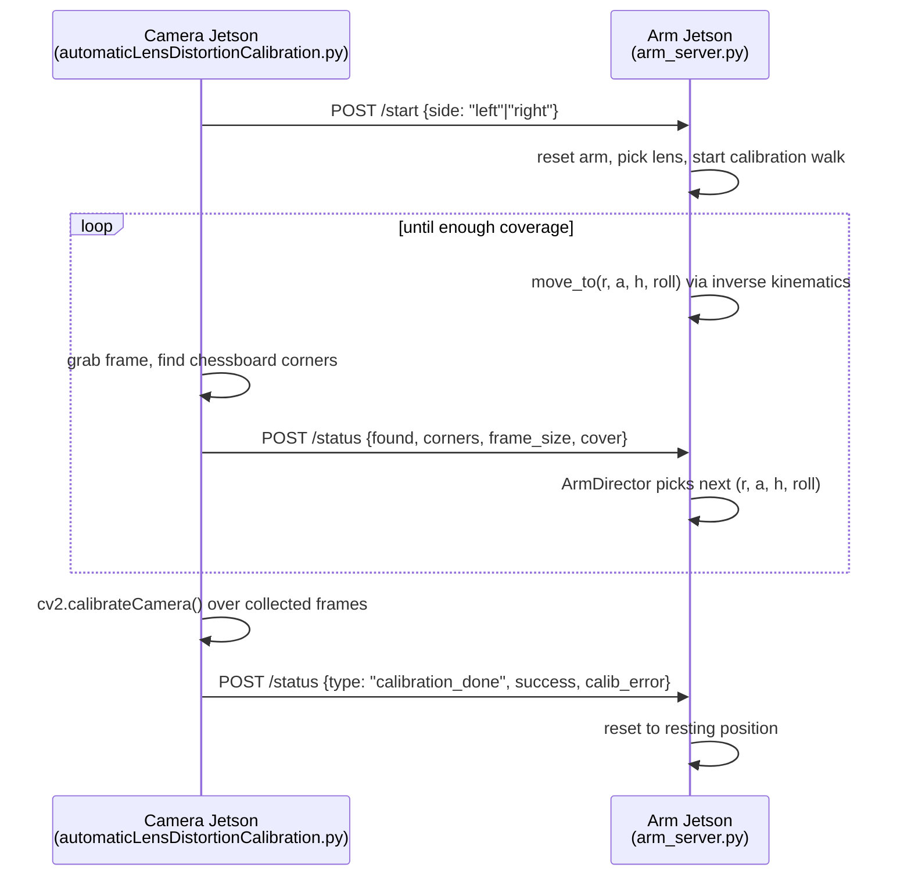

# Robotic Calibration Arm

<a href="https://youtube.com/shorts/9PEGZUqVP_8?feature=share"> Watch the robotic calibration arm in action</a>


A 6-DOF robotic arm that automates **camera lens-distortion calibration**. Instead of a person waving a checkerboard in front of a camera, the arm holds the checkerboard and sweeps it through the camera's field of view on its own - panning, tilting, and rolling until enough frame coverage has been collected, then triggers the calibration computation.

The system runs across **two Jetson boards** talking to each other over HTTP:

- **Camera Jetson** - grabs frames, detects the checkerboard, and runs `cv2.calibrateCamera`.
- **Arm Jetson** - drives the 6 servos and decides where to move next based on what the camera sees.

## Overview



1. The camera side streams video, and every so often runs `findChessboardCorners` on a frame. It tracks the **convex hull area of all corners seen so far** as a percentage of the frame — this is the "cover" metric that decides when enough of the frame has been sampled.
2. Every frame result (`found`, `corners`, `frame_size`, `cover`) is POSTed to the arm's `/status` endpoint.
3. The arm's `ArmDirector` treats the checkerboard's bounding corners like a ball bouncing around inside the camera frame: it drives the board toward one edge, and once it gets within a padding threshold of that edge, it "bounces" toward the next edge (right → up → left → down → ...), decelerating as it approaches. Periodically it also **rolls** the board to a different angle (from a fixed rotation cycle) so the calibration sees the pattern from multiple orientations, not just flat-on.
4. Each `(r, θ, h, roll)` target — polar coordinates around the camera lens, plus a roll angle — is solved by the **inverse-kinematics compiler** into 6 servo angles, which are then written to the physical servos.
5. Once coverage/frame-count thresholds are hit, the camera runs `cv2.calibrateCamera`, computes the reprojection error, and reports success/failure back to the arm, which resets to its resting position.l

## The arm (`src/arm`)

The arm is a 6-servo manipulator:

| # | Joint    | Servo type | Notes |
|---|----------|-----------|-------|
| 0 | base     | DS3218 (270°) | yaw of the whole arm |
| 1 | shoulder | DS3218 (270°) | |
| 2 | elbow    | DS3218 (270°) | |
| 3 | wrist    | DS3218 (270°) | tilt, kept perpendicular to the ground by default |
| 4 | yaw      | MG996R (180°) | orients the checkerboard mount |
| 5 | roll     | MG996R (180°) | rolls the checkerboard for varied-angle shots |

All servos are driven through a PCA9685 PWM controller via `adafruit_servokit.ServoKit`. Hardware details (pulse-width range, actuation range per servo *type*), per-joint `logical_zero` offsets, and per-joint safe `operating_range` limits all live in [config.json](src/arm/config.json) — `Servo` and `IKCompiler` read from it rather than hardcoding hardware numbers.

### Inverse kinematics (`ik_compiler.py`)

A target is expressed in **polar coordinates around one of the two camera lenses**: distance `r`, angle `θ` off the lens's center-line, height `h`, and a `roll` angle for the checkerboard mount. `IKCompiler.calc_angle_config()`:

1. Converts `(r, θ, h)` into a 3D target position relative to the selected lens (`left` or `right`, each with its own position/angle offset in `config.json`).
2. Solves for **base** and **yaw** angles geometrically (the yaw axis sits on a circle of radius `L2` around the target, and the base angle comes from the tangent line from the base position to that circle), picking the solution closest to a neutral heading when two exist.
3. Derives the wrist position from the yaw solution, then solves **shoulder** and **elbow** with the cosine rule over the arm's link lengths.
4. Derives **wrist tilt** from the shoulder/elbow angles so the mount stays perpendicular to the ground.
5. `to_servo_angels()` maps these logical joint angles to physical servo angles using each joint's `logical_zero`, and raises if any angle falls outside its configured `operating_range`.

`figures/` contains the geometric derivations behind this math as TikZ diagrams: **[calc_yaw_and_base_angles.pdf](<figures/calc_yaw_and_base_angles().pdf>)** and **[calc_shoulder_and_elbow_angles.pdf](<figures/calc_shoulder_and_elbow_angles().pdf>)**.

### The calibration walk (`arm_director.py`)

`ArmDirector` decides where the arm moves next, using only what the camera last reported (whether the board was `found`, its `corners`, and the `frame_size`):

- It measures, per edge (`left`/`right`/`up`/`down`), how much padding is left between the checkerboard and that edge of the frame.
- Movement has "momentum" along one axis at a time (angle `a` or height `h`), heading toward a target edge.
- When the board gets within `padding_pct` of its target edge, direction "bounces" to the next edge in the cycle `right → up → left → down → right → ...`, with a correcting nudge if it overshoots.
- Speed decelerates smoothly as the board approaches its target edge (`deceleration()`), so it doesn't get stuck bouncing right at the frame boundary.
- Every step also advances through a fixed list of `rotations` (roll angles) from `config.json`, so the walk cycles through several checkerboard orientations while sweeping the frame.
- If the board is lost (not found, no edge contact) for longer than the rotation cycle length, it raises — treated as a lighting/visibility problem upstream.

### Manual control (`cli.py`)

A standalone REPL for jogging the arm without the Flask server — useful when measuring geometry or tuning `config.json`:

```
<channel> <angle>            # move a single servo directly, e.g. "1 120"
r <r> a <a> h <h> [ro <ro>]  # solve an IK target and move there, e.g. "r 17 a 0 h 0"
reset                        # move to the configured zero_state
exit
```

### The Flask server (`arm_server.py`)

Two endpoints, meant to be called by the camera Jetson:

- `POST /start {side: "left"|"right"}` — resets the arm, then runs the calibration walk loop in a background process (only one walk can run at a time).
- `POST /status {...}` — receives either a per-frame status update (feeds `ArmDirector.next_position()`) or a `calibration_done` result (ends the walk and resets the arm).

## The camera (`src/camera`)

`automaticLensDistortionCalibration.py` runs on the camera Jetson (CSI cameras via GStreamer/`nvarguscamerasrc`). For a given `--side` it:

- Streams an MJPEG feed over Flask (`/left`, `/right`) for live viewing.
- Periodically checks for chessboard corners in the frame, and tracks a running **convex-hull coverage percentage** across all corners seen so far — the signal `ArmDirector` uses to steer the arm toward under-sampled regions of the frame.
- Reports every frame result to the arm Jetson via `calibrartion_arm_client.send_frame_status()`.
- Once enough images/coverage are collected, runs `cv2.calibrateCamera`, computes the mean reprojection error against `max_calibration_error`, saves the intrinsic matrix / distortion coefficients / undistortion lookup tables, and reports success via `send_calibration_done()`.

## Configuration (`src/arm/config.json`)

| Section | Purpose |
|---|---|
| `arm.servos.types` | Hardware specs (pulse-width range, actuation range) per servo model |
| `arm.servos."0"`–`"5"` | Per-joint name, type, `logical_zero`, `operating_range`, and (for base/shoulder) fixed 3D `position` |
| `arm.lengths` | Link lengths used by the IK solver (`L1`/`L2`/`L3`, `shoulder_arm`, `elbow_arm`, `wrist_arm`) |
| `arm.zero_state` | Servo angles for the resting position |
| `arm.director` | Calibration-walk tuning: start point (`r`, `a0`, `h0`, `ro0`), step sizes (`da`, `dh`), the roll-angle cycle (`rotations`), and the edge-proximity threshold (`padding_pct`) |
| `camera.lenses.left_lens` / `right_lens` | Each lens's position and angle in the arm's coordinate frame |


This immediately tells the arm to start the calibration walk for the given side.


## Dependencies

- Arm side: `adafruit-circuitpython-servokit`, `flask`, `numpy`
- Camera side: `opencv-python`, `numpy`, `scipy`, `flask`, `requests`

## Installation

Each Jetson only needs the one subfolder it actually runs (`src/arm` or `src/camera`) — clone the whole repo on your dev machine, then push just that subfolder out to each device.

### Arm Jetson

1. Enable the I2C bus the PCA9685 talks over (`sudo /opt/nvidia/jetson-io/jetson-io.py` on newer L4T, or `sudo usermod -aG i2c $USER` + reboot if I2C is already enabled) and wire the PCA9685 to the Jetson's I2C pins.
2. Create a virtualenv and install dependencies:
   ```bash
   python3 -m venv ~/arm-env
   source ~/arm-env/bin/activate
   pip install adafruit-circuitpython-servokit flask numpy
   ```
3. Get the code onto the board - either clone the repo directly, or pull just the `arm` subfolder from the latest commit on the branch you want:
   ```bash
   curl -sL https://github.com/<your-github-user>/robotic-calibration-arm/archive/refs/heads/dynamic.tar.gz \
     | tar -xz --strip-components=3 "robotic-calibration-arm-dynamic/src/arm"
   ```
4. Adjust `config.json` for your physical build (link lengths, per-servo `logical_zero`/`operating_range`, lens positions) — see [Configuration](#configuration-srcarmconfigjson) below.
5. Run the server:
   ```bash
   cd RoboticArm
   source ~/arm-env/bin/activate
   python arm_server.py --port 5001
   ```
   Or use `cli.py` instead of `arm_server.py` to jog the arm manually while tuning `config.json`.

6. (**Recommended**) run it as a systemd service so it survives reboots and SSH disconnects, instead of a manual `python arm_server.py` in a terminal. Create `/etc/systemd/system/arm-server.service`:
   ```ini
   [Unit]
   Description=Robotic Calibration Arm - arm_server
   After=network.target

   [Service]
   User=<arm-jetson-user>
   WorkingDirectory=/home/<arm-jetson-user>/RoboticArm
   ExecStart=/home/<arm-jetson-user>/arm-env/bin/python arm_server.py --port 5001
   Restart=on-failure
   RestartSec=2

   [Install]
   WantedBy=multi-user.target
   ```
   Then enable and start it:
   ```bash
   sudo systemctl daemon-reload
   sudo systemctl enable --now arm-server
   journalctl -u arm-server -f   # follow logs
   ```

### Camera Jetson

1. Use the JetPack-provided OpenCV (built with GStreamer/`nvarguscamerasrc` support) rather than a pip-installed `opencv-python`, since the pipeline in `gstreamer_pipeline()` needs the NVIDIA camera plugins. Install the rest into that same environment (a venv with `--system-site-packages`, so it can still see the system OpenCV):
   ```bash
   python3 -m venv ~/camera-env --system-site-packages
   source ~/camera-env/bin/activate
   pip install numpy scipy flask requests
   ```
2. Get the code onto the board - either clone the repo directly, or pull just the `camera` subfolder from the latest commit on the branch you want:
   ```bash
   curl -sL https://github.com/<your-github-user>/robotic-calibration-arm/archive/refs/heads/dynamic.tar.gz \
     | tar -xz --strip-components=3 "robotic-calibration-arm-dynamic/src/camera"
   ```
3. In `calibrartion_arm_client.py`, point `ARM_JETSON_IP` at the arm Jetson's address (or pass `--arm-jetson-ip` at launch).
4. Run it, picking which lens this process is driving with `--side`:
   ```bash
   cd RoboticArm/camera
   source ~/camera-env/bin/activate
   python automaticLensDistortionCalibration.py --side left --arm-jetson-ip <arm-jetson-ip>
   ```
   This serves the MJPEG feed on port 5000 and, on `/start`, drives the calibration walk described above.

### Networking

Both scripts talk over plain HTTP by hostname/IP, so the two Jetsons need to be able to reach each other (same LAN, or a static IP on each if your network doesn't hand out stable DHCP leases). No further discovery/config is needed beyond setting `ARM_JETSON_IP`/`--arm-jetson-ip` on the camera side.
